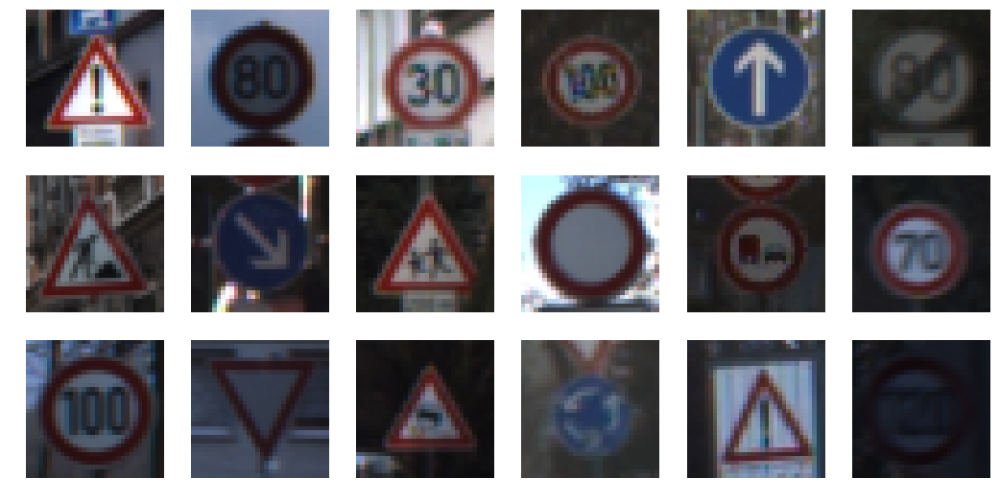

# Rubric Points

Here I will consider the [rubric points](https://review.udacity.com/#!/rubrics/481/view) individually and describe how I
addressed each point in my implementation.

## Writeup / README

Provide a Writeup / README that includes all the rubric points and how you
addressed each one. You can submit your writeup as markdown or pdf. You can
use this template as a guide for writing the report. The submission includes
the project code.

You're reading it! and here is a link to my [project code](https://github.com/udacity/CarND-Traffic-Sign-Classifier-Project/blob/master/Traffic_Sign_Classifier.ipynb).

## Data Set Summary & Exploration

### 1. Summary

Provide a basic summary of the data set. In the code, the analysis should
be done using python, numpy and/or pandas methods rather than hardcoding
results manually.

I used raw numpy to calculate summary statistics of the traffic signs data
set:

-   The size of training set is 34799 samples.
-   The size of the validation set is 4410 samples.
-   The size of test set is 12630
-   The shape of a traffic sign image is 32x32x3.
-   The number of unique classes/labels in the data set is 43.

### 2. Include an exploratory visualization of the dataset.

Here is an exploratory visualization of the data set. It's a random sample
of a couple dozen images from the dataset.

## Design and Test a Model Architecture

### Preprocessing

As a first step, I decided to convert the images to grayscale. I did this
because when I was training, I found that the model tended to overfit the
dataset, and as such I wanted to reduce the number of trainable parameters.
Having fewer parameters also helped me train faster.

Here is an example of a traffic sign image before and after grayscaling.

As a last step, I normalized the image data because removes the need for
the network to learn a bias.

### Architecture

My final model consisted of the following layers:

| Layer           | Description                  |
|-----------------|------------------------------|
| Input           | 32x32x3 RGB image            |
| Convolution 5x5 | 1x1 stride, outputs 28x28x6  |
| RELU            |                              |
| Max pooling     | 2x2 stride, outputs 14x14x6  |
| Convolution 5x5 | 1x1 stride, outputs 10x10x16 |
| RELU            |                              |
| Max pooling     | 2x2 stride, outputs 5x5x16   |
| Fully connected | 400 -> 120                   |
| Fully connected | 120 -> 84                    |
| Fully connected | 84 -> 43                     |
| Softmax         |                              |

### Training

I trained the model using the Adam optimizer on cross entropy loss, with a
learning rate of `5e-4` and a batchsize of 64 for 40 epochs. I also used
dropout on the fully connected layers with a dropout probability of 50%.

### Approach

I started out with the LeNet-5 architecture from class, since it was
known to work on images of about the size of our inputs. It also uses
convolutional layers, which are beneficial here because they provide the
model with translational invariance. This initial setup worked okay, getting
up to 89% with some random hyperparameter sampling.

In examining the performance, I found a sizable gap between the training and
validation set. I figured this was overfitting, so I tried to reduce the
number of parameters in the model by making the inputs grayscale before
feeding them in, and adding dropout to the fully connected layers. With
another hyperparameter search, this got me up to 95.6% validation accuracy.

My final model results were:

-   training set accuracy of 99.4%
-   validation set accuracy of 95.6%
-   test set accuracy of 93.8%

## Test a Model on New Images

### Choose five German traffic signs found on the web

Choose five German traffic signs found on the web and provide them in the
report. For each image, discuss what quality or qualities might be
difficult to classify.

Here are five German traffic signs that I found on the web:

<./german-signs/1.ppm> <./german-signs/2.ppm> <./german-signs/3.ppm> <./german-signs/4.ppm> <./german-signs/5.ppm>

I thought that the last three images would be tough to classify, because
they looked very similar. I myself had a hard time telling what they said.

### Discuss the model's predictions

on these new traffic signs and compare the results to predicting on the
test set. At a minimum, discuss what the predictions were, the accuracy on these
new predictions, and compare the accuracy to the accuracy on the test set
(OPTIONAL: Discuss the results in more detail as described in the "Stand Out
Suggestions" part of the rubric).

Here are the results of the prediction:

| Image           | Prediction      |
|-----------------|-----------------|
| 80 km/h         | 80 km/h         |
| 60 km/h         | 60 km/h         |
| 100 km/h        | 100 km/h        |
| traffic signals | traffic signals |
| pedestrians     | pedestrians     |

The model got all of them correct, for an accuracy of 100%. This isn't too
surprising, since on the test set the likelihood of getting five out of five
is ~76%.

### Discuss certainty

In the first image, the model is very certain (97%) that it's an 80 km/h
sign, and it is.

|  Probability | Prediction            |
|--------------|-----------------------|
|   0.96988785 | Speed limit (80km/h)  |
|  0.012924107 | Speed limit (100km/h) |
| 0.0067109498 | Speed limit (60km/h)  |
| 0.0055539473 | Speed limit (30km/h)  |
| 0.0013646282 | Speed limit (120km/h) |

In the first image, the model is pretty sure (79%) that it's an 60 km/h
sign, and it is.

|  Probability | Prediction            |
|--------------|-----------------------|
|   0.78752875 | Speed limit (60km/h)  |
|    0.1534175 | Speed limit (80km/h)  |
|  0.011660059 | Speed limit (120km/h) |
| 0.0084663546 | Speed limit (20km/h)  |
| 0.0076186014 | Speed limit (30km/h)  |

In the first image, the model is very certain (99%) that it's an 60 km/h
sign, and it is.

|   Probability | Prediction                               |
|---------------|------------------------------------------|
|    0.98857981 | Speed limit (100km/h)                    |
|   0.007177257 | Speed limit (120km/h)                    |
|  0.0015737284 | Speed limit (80km/h)                     |
|  0.0010419616 | Speed limit (50km/h)                     |
| 0.00059464743 | Vehicles over 3.5 metric tons prohibited |

In each of the three above images, the top four possibilities are between
different speed limit signs. There might be some utility to clustering
image classes by how likely they are to be confused with each other.

In the remaining two examples the network had a little more trouble
determining the correct answer (58% and 59% confidence).

| Probability | Prediction          |
|-------------|---------------------|
|  0.57780051 | Traffic signals     |
| 0.059839182 | Go straight or left |
| 0.053755533 | General caution     |
| 0.049073901 | Road work           |
|  0.04552497 | Priority road       |

| Probability | Prediction                            |
|-------------|---------------------------------------|
|  0.59250933 | Pedestrians                           |
|  0.15689372 | General caution                       |
| 0.075403072 | Right-of-way at the next intersection |
| 0.038806669 | Road narrows on the right             |
| 0.030463731 | Traffic signals                       |

## Visualizing the Neural Network

In the first layer we can pretty clearly see that it seems to be doing some
simple edge detection. One interesting feature is that filter 0 triggers for
higher frequency features than eg. filter 5.

In the second layer there are a couple of filters which we might generously
claim are picking up text. Most of the filters seem to be focused on picking
out particular features of the edge of the sign. Some are especially focused
on picking out slants, others curves, and still others horizontal lines.

